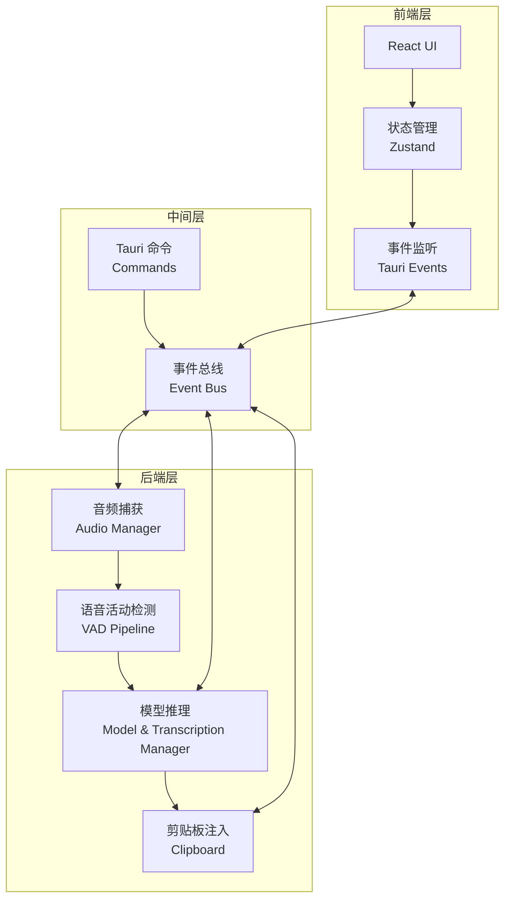

# cc-handy 项目 Code Wiki

## 1. 项目概述

cc-handy 是一款跨平台的桌面级语音转文本（Speech-to-Text）应用程序，基于 Tauri 构建，采用 Rust 处理高性能后端计算，React/TypeScript 构建现代化前端界面。本项目基于 [cjpais/Handy](https://github.com/cjpais/Handy) 项目进行二次开发。

### 主要功能
- **本地离线语音识别**：内置 Whisper 模型，支持 GPU 加速推理，所有录音和处理均在本地完成，确保隐私安全且无需网络
- **全局快捷键与对讲机模式**：支持全局快捷键唤醒录音，并提供类似对讲机的“按住说话”（Push-to-Talk）功能
- **智能静音检测 (VAD)**：集成 Silero VAD 进行精确的语音活动检测，有效过滤空白噪音，提升识别速度
- **无缝光标输入**：识别完成后，自动将转换出的文本粘贴到当前系统活跃应用程序的光标位置
- **多语言与翻译支持**：支持多语言的语音输入，并内置实时翻译选项
- **系统托盘运行**：开机自启并默认最小化到系统托盘，保持单实例后台运行，随时待命
- **HuggingFace 模型市场集成**：内置模型市场，支持浏览、搜索并直接下载 HuggingFace 上的 Whisper 开源模型
- **模型趋势数据展示**：直观展示各类语音模型的流行趋势数据，方便用户选择最适合的推理模型

## 2. 技术栈

### 前端技术栈
- React 18
- TypeScript
- Vite
- TailwindCSS
- Zustand (状态管理)
- i18next (国际化)

### 后端技术栈
- Rust
- Tauri
- whisper-rs (Whisper 模型推理)
- cpal (跨平台音频捕获)
- vad-rs (Silero VAD 语音活动检测)
- rdev (系统级全局键盘快捷键监听)
- rubato / rodio (音频处理与反馈音效)

### 核心依赖

| 依赖 | 用途 | 位置 |
|------|------|------|
| @tauri-apps/api | Tauri 前端 API | [package.json](file:///workspace/package.json) |
| @tauri-apps/plugin-global-shortcut | 全局快捷键支持 | [package.json](file:///workspace/package.json) |
| zustand | 状态管理 | [package.json](file:///workspace/package.json) |
| i18next | 国际化支持 | [package.json](file:///workspace/package.json) |
| tauri | 桌面应用框架 | [src-tauri/Cargo.toml](file:///workspace/src-tauri/Cargo.toml) |
| transcribe-rs | 语音转文本核心库 | [src-tauri/Cargo.toml](file:///workspace/src-tauri/Cargo.toml) |
| cpal | 跨平台音频捕获 | [src-tauri/Cargo.toml](file:///workspace/src-tauri/Cargo.toml) |
| vad-rs | 语音活动检测 | [src-tauri/Cargo.toml](file:///workspace/src-tauri/Cargo.toml) |
| rdev | 全局键盘监听 | [src-tauri/Cargo.toml](file:///workspace/src-tauri/Cargo.toml) |

## 3. 项目架构

cc-handy 核心采用了 **Manager Pattern（管理器模式）** 和 **Pipeline Processing（流水线处理）** 架构设计。

### 架构流程图



### 核心模块职责

| 模块 | 职责 | 文件位置 |
|------|------|----------|
| 音频捕获 | 监听系统麦克风，捕获音频输入 | [src-tauri/src/managers/audio.rs](file:///workspace/src-tauri/src/managers/audio.rs) |
| 语音活动检测 | 使用 Silero VAD 识别有效人声片段 | [src-tauri/src/audio_toolkit/vad/](file:///workspace/src-tauri/src/audio_toolkit/vad/) |
| 模型管理 | 管理模型的下载、加载和切换 | [src-tauri/src/managers/model.rs](file:///workspace/src-tauri/src/managers/model.rs) |
| 转录管理 | 将音频流送入 Whisper 模型进行文本转录 | [src-tauri/src/managers/transcription.rs](file:///workspace/src-tauri/src/managers/transcription.rs) |
| 历史管理 | 管理转录历史记录 | [src-tauri/src/managers/history.rs](file:///workspace/src-tauri/src/managers/history.rs) |
| 快捷键管理 | 处理全局快捷键和热键 | [src-tauri/src/shortcut/](file:///workspace/src-tauri/src/shortcut/) |
| 转录协调器 | 协调整个转录流程 | [src-tauri/src/transcription_coordinator.rs](file:///workspace/src-tauri/src/transcription_coordinator.rs) |

## 4. 目录结构

### 前端目录结构

```
/src
  /components        # React 组件
    /footer          # 页脚组件
    /icons           # 图标组件
    /model-selector  # 模型选择器组件
    /onboarding      # 引导流程组件
    /settings        # 设置相关组件
    /shared          # 共享组件
    /ui              # UI 基础组件
    /update-checker  # 更新检查组件
    AccessibilityPermissions.tsx  #  accessibility 权限组件
    Sidebar.tsx      # 侧边栏组件
  /hooks             # 自定义 React Hooks
  /i18n             # 国际化资源
    /locales         # 语言文件
  /lib              # 工具库
    /constants       # 常量定义
    /types           # 类型定义
    /utils           # 工具函数
  /overlay          # 录音覆盖层
  /stores           # Zustand 状态管理
  /styles           # 样式文件
  /utils            # 工具函数
  App.css           # 应用样式
  App.tsx           # 应用主组件
  bindings.ts       # Tauri 命令绑定
  main.tsx          # 应用入口
```

### 后端目录结构

```
/src-tauri
  /capabilities     # 能力配置
  /gen              # 生成文件
  /icons            # 应用图标
  /nsis             # Windows 安装脚本
  /resources        # 资源文件
    /models         # 模型文件
  /src              # Rust 源代码
    /audio_toolkit  # 音频处理工具包
      /audio        # 音频设备和录制
      /vad          # 语音活动检测
    /commands       # Tauri 命令
    /helpers        # 辅助函数
    /managers       # 核心管理器
    /shortcut       # 快捷键处理
    actions.rs      # 动作定义
    audio_feedback.rs  # 音频反馈
    cli.rs          # 命令行接口
    clipboard.rs    # 剪贴板操作
    input.rs        # 输入处理
    lib.rs          # 库入口
    main.rs         # 应用入口
    overlay.rs      # 覆盖层管理
    settings.rs     # 设置管理
    transcription_coordinator.rs  # 转录协调器
    tray.rs         # 系统托盘
  Cargo.toml        # Rust 依赖配置
  tauri.conf.json   # Tauri 配置
```

## 5. 核心功能模块

### 5.1 语音识别流程

1. **音频捕获**：通过 AudioRecordingManager 从系统麦克风捕获音频
2. **语音活动检测**：使用 Silero VAD 检测有效语音片段，过滤噪音
3. **模型推理**：将音频送入 Whisper 模型进行文本转录
4. **结果处理**：处理转录结果，应用后处理（如翻译）
5. **输出注入**：通过剪贴板或键盘模拟将结果粘贴到当前活跃窗口

### 5.2 模型管理

- **模型下载**：支持从 HuggingFace 下载 Whisper 模型
- **模型切换**：在不同模型之间无缝切换
- **模型状态管理**：跟踪模型的加载、卸载状态
- **模型加速**：根据不同平台选择最佳加速方案（Metal、Vulkan、OpenBLAS）

### 5.3 快捷键系统

- **全局快捷键**：支持设置全局快捷键触发录音
- **按住说话模式**：类似对讲机的 Push-to-Talk 功能
- **自定义快捷键**：允许用户自定义各种操作的快捷键

### 5.4 系统托盘

- **系统集成**：在系统托盘中运行，保持后台活动
- **快速操作**：通过托盘菜单快速访问常用功能
- **状态指示**：显示当前应用状态（空闲、录音中、转录中）

### 5.5 国际化

- **多语言支持**：支持多种语言的界面和语音识别
- **实时翻译**：将识别结果实时翻译为其他语言

## 6. 关键类与函数

### 前端关键类与函数

| 类/函数 | 描述 | 文件位置 |
|---------|------|----------|
| `App` | 应用主组件，处理初始化和状态管理 | [src/App.tsx](file:///workspace/src/App.tsx) |
| `useModelStore` | 模型状态管理，处理模型的加载和切换 | [src/stores/modelStore.ts](file:///workspace/src/stores/modelStore.ts) |
| `useSettingsStore` | 设置状态管理，处理应用配置 | [src/stores/settingsStore.ts](file:///workspace/src/stores/settingsStore.ts) |
| `useThemeStore` | 主题状态管理，处理应用主题 | [src/stores/themeStore.ts](file:///workspace/src/stores/themeStore.ts) |
| `Onboarding` | 新用户引导流程组件 | [src/components/onboarding/Onboarding.tsx](file:///workspace/src/components/onboarding/Onboarding.tsx) |
| `ModelSelector` | 模型选择和管理组件 | [src/components/model-selector/ModelSelector.tsx](file:///workspace/src/components/model-selector/ModelSelector.tsx) |

### 后端关键类与函数

| 类/函数 | 描述 | 文件位置 |
|---------|------|----------|
| `AudioRecordingManager` | 音频录制管理器，处理麦克风输入 | [src-tauri/src/managers/audio.rs](file:///workspace/src-tauri/src/managers/audio.rs) |
| `ModelManager` | 模型管理器，处理模型的下载和加载 | [src-tauri/src/managers/model.rs](file:///workspace/src-tauri/src/managers/model.rs) |
| `TranscriptionManager` | 转录管理器，处理音频到文本的转换 | [src-tauri/src/managers/transcription.rs](file:///workspace/src-tauri/src/managers/transcription.rs) |
| `HistoryManager` | 历史管理器，存储和管理转录历史 | [src-tauri/src/managers/history.rs](file:///workspace/src-tauri/src/managers/history.rs) |
| `TranscriptionCoordinator` | 转录协调器，协调整个转录流程 | [src-tauri/src/transcription_coordinator.rs](file:///workspace/src-tauri/src/transcription_coordinator.rs) |
| `run` | 应用主函数，初始化和启动应用 | [src-tauri/src/lib.rs](file:///workspace/src-tauri/src/lib.rs) |

## 7. 状态管理

### 前端状态管理

项目使用 Zustand 进行前端状态管理，主要包含以下状态存储：

1. **模型状态** (`modelStore`)
   - 管理可用模型列表
   - 跟踪模型下载和加载状态
   - 处理模型切换逻辑

2. **设置状态** (`settingsStore`)
   - 管理应用配置
   - 处理设置的保存和加载
   - 提供音频设备管理

3. **主题状态** (`themeStore`)
   - 管理应用主题
   - 处理主题切换

### 后端状态管理

后端使用 Tauri 的状态管理系统，通过 `app.manage()` 方法将核心管理器添加到应用状态中：

```rust
// 初始化核心管理器
let recording_manager = Arc::new(AudioRecordingManager::new(app_handle).expect("Failed to initialize recording manager"));
let model_manager = Arc::new(ModelManager::new(app_handle).expect("Failed to initialize model manager"));
let transcription_manager = Arc::new(TranscriptionManager::new(app_handle, model_manager.clone()).expect("Failed to initialize transcription manager"));
let history_manager = Arc::new(HistoryManager::new(app_handle).expect("Failed to initialize history manager"));

// 添加到 Tauri 状态
app_handle.manage(recording_manager.clone());
app_handle.manage(model_manager.clone());
app_handle.manage(transcription_manager.clone());
app_handle.manage(history_manager.clone());
```

## 8. 事件系统

项目使用 Tauri 的事件系统进行前后端通信：

### 主要事件

| 事件名称 | 描述 | 方向 |
|---------|------|------|
| `model-state-changed` | 模型状态变更通知 | 后端 → 前端 |
| `recording-error` | 录音错误通知 | 后端 → 前端 |
| `check-for-updates` | 检查更新请求 | 前端 → 后端 |
| `history-updated` | 历史记录更新通知 | 后端 → 前端 |

### 事件监听示例

```typescript
// 前端监听录音错误
useEffect(() => {
  const unlisten = listen<RecordingErrorEvent>("recording-error", (event) => {
    const { error_type, detail } = event.payload;
    // 处理错误...
  });
  return () => {
    unlisten.then((fn) => fn());
  };
}, [t]);
```

## 9. 依赖关系

### 前端依赖

| 依赖 | 用途 | 版本 |
|------|------|------|
| React | UI 库 | ^18.3.1 |
| TypeScript | 类型系统 | ~5.6.3 |
| Vite | 构建工具 | ^6.4.1 |
| TailwindCSS | 样式框架 | ^4.1.16 |
| Zustand | 状态管理 | ^5.0.8 |
| i18next | 国际化 | ^25.7.2 |
| @tauri-apps/api | Tauri API | ^2.10.0 |

### 后端依赖

| 依赖 | 用途 | 版本 |
|------|------|------|
| tauri | 桌面应用框架 | 2.10.2 |
| transcribe-rs | 语音转文本 | 0.3.8 |
| cpal | 音频捕获 | 0.16.0 |
| vad-rs | 语音活动检测 | (git) |
| rdev | 键盘监听 | (git) |
| rodio | 音频处理 | (git) |
| rusqlite | 数据库 | 0.37 |

## 10. 项目运行与开发

### 开发环境设置

1. **安装依赖**
   ```bash
   bun install
   ```

2. **准备基础 VAD 模型**
   ```bash
   mkdir -p src-tauri/resources/models
   curl -o src-tauri/resources/models/silero_vad_v4.onnx https://hf-mirror.com/wongeuler/silero-vad/resolve/main/silero_vad_v4.onnx
   ```

3. **启动开发服务器**
   ```bash
   bun run tauri dev
   
   # 如果在 macOS 上遇到 cmake 错误，请使用以下命令：
   # CMAKE_POLICY_VERSION_MINIMUM=3.5 bun run tauri dev
   ```

### 构建生产版本

```bash
bun run tauri build
```

### 独立前端开发

如果你只希望修改界面 UI，可以单独运行前端构建流：

```bash
bun run dev        # 启动 Vite 开发服务器
bun run build      # 仅构建前端
bun run preview    # 预览构建的前端产物
```

## 11. 配置与部署

### 配置文件

- **前端配置**：`vite.config.ts`、`tsconfig.json`
- **后端配置**：`src-tauri/tauri.conf.json`、`src-tauri/Cargo.toml`
- **默认设置**：`src-tauri/resources/default_settings.json`

### 部署选项

- **Windows**：生成 `.exe` 安装包
- **macOS**：生成 `.dmg` 安装包
- **Linux**：生成 `.deb` 和 `.AppImage` 安装包

## 12. 故障排除

### 常见问题

1. **麦克风权限问题**
   - 确保在系统设置中授予应用麦克风访问权限
   - 在 Windows 上，检查隐私设置中的麦克风权限
   - 在 macOS 上，检查系统偏好设置中的安全性与隐私

2. **模型加载失败**
   - 确保模型文件完整下载
   - 检查 GPU 加速设置是否正确
   - 查看日志文件获取详细错误信息

3. **快捷键不工作**
   - 确保应用有全局快捷键权限
   - 检查是否与其他应用的快捷键冲突
   - 尝试重新设置快捷键

### 日志位置

- **Windows**：`%APPDATA%\cc-handy\logs`
- **macOS**：`~/Library/Logs/cc-handy`
- **Linux**：`~/.local/share/cc-handy/logs`

## 13. 二次开发指南

### 新增功能

1. **前端功能**：在 `src/components` 中添加新组件，在 `src/stores` 中添加相应状态管理
2. **后端功能**：在 `src-tauri/src` 中添加新模块，在 `src-tauri/src/commands` 中添加新命令
3. **事件通信**：使用 Tauri 的事件系统进行前后端通信

### 模型集成

1. **添加新模型**：在 `src-tauri/src/managers/model.rs` 中添加模型支持
2. **模型市场**：扩展 `src-tauri/src/commands/models.rs` 中的模型市场功能

### 国际化

1. **添加新语言**：在 `src/i18n/locales` 中添加新的语言文件
2. **更新翻译**：运行 `bun run check:translations` 检查翻译完整性

## 14. 总结

cc-handy 是一款功能强大的跨平台语音转文本应用，通过结合 Rust 的高性能和 React 的现代化界面，提供了本地离线的语音识别解决方案。其核心优势在于：

- **隐私安全**：所有处理均在本地完成，无需网络连接
- **高性能**：利用 GPU 加速和优化的音频处理流程
- **用户友好**：现代化的界面设计和直观的用户体验
- **可扩展性**：模块化的架构设计，便于二次开发和功能扩展
- **跨平台**：支持 Windows、macOS 和 Linux 系统

通过不断的优化和扩展，cc-handy 有望成为语音转文本领域的领先工具，为用户提供更高效、更便捷的语音输入体验。